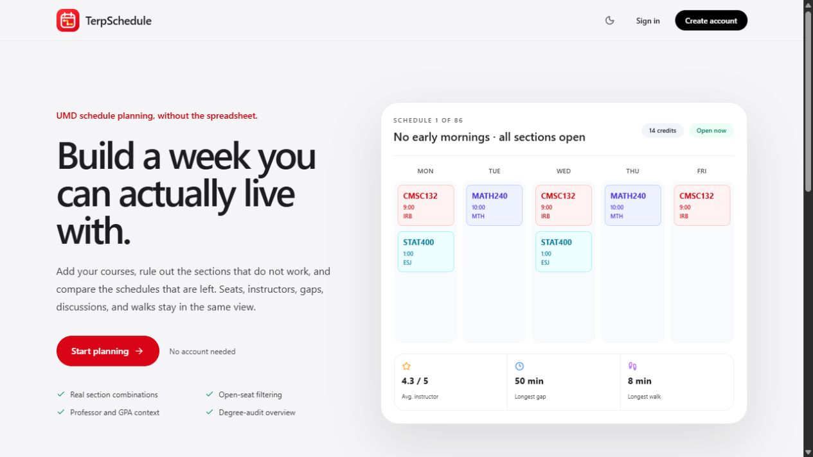
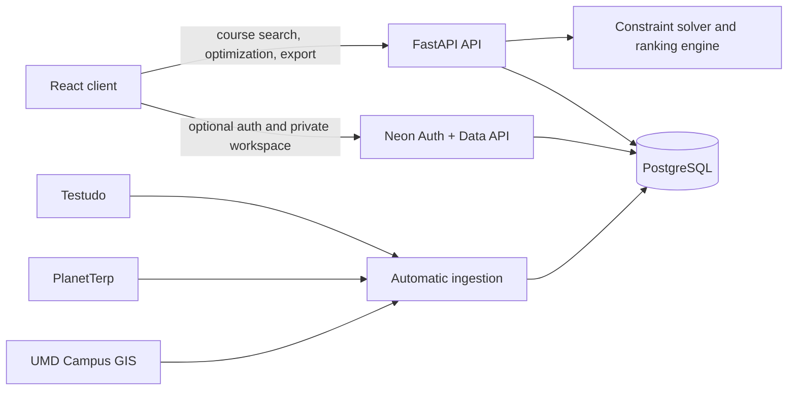

# TerpSchedule

**A full-stack UMD schedule builder that generates, ranks, edits, and saves conflict-free class schedules.**

[Open the live demo](https://terpschedule.terpschedule.workers.dev/) · [View data-source notes](DATA_SOURCES.md)



TerpSchedule brings course search, section availability, instructor context, walking estimates, and degree progress into one planning workflow. Students can generate ranked schedules from hard constraints, adjust any result manually, and keep selected schedules with an optional account.

> TerpSchedule is an unofficial planning tool. Testudo and the official UMD degree audit remain authoritative for registration and degree progress.

## Highlights

- Generate conflict-free schedules for up to eight courses.
- Filter by time window, days off, maximum gaps, instructors, and section availability.
- Rank instructor quality, compactness, campus days, and walking ease by priority.
- Compare all results, schedules with every section open, and schedules containing a waitlist-or-closed section.
- Distinguish lectures, discussions, recitations, labs, online meetings, and other meeting types.
- Inspect seats, credits, professor ratings, historical course GPA, room information, and the next walk from the calendar.
- Add, replace, or remove sections manually with immediate conflict detection and metric recalculation.
- Save, rename, share, re-open, and export schedules as `.ics` files.
- Import a printer-friendly UMD degree-audit PDF into a structured progress view; uploaded PDFs are not retained.
- Use the planner as a guest or sync planning data across devices with an optional account.
- Switch between light, dark, and system themes on desktop and mobile.

## Technology stack

| Layer | Technologies |
| --- | --- |
| Frontend | React 19, TypeScript, Vite, Tailwind CSS, Lucide, Recharts |
| Backend | Python 3.11+, FastAPI, Pydantic, SQLAlchemy asyncio |
| Data | PostgreSQL in production, SQLite for local development, Neon Auth and Data API with row-level security |
| Data ingestion | Testudo Schedule of Classes, PlanetTerp, UMD Campus GIS |
| Testing | pytest, Playwright, axe-core, oxlint, TypeScript compiler |
| Deployment | Cloudflare Workers static assets, Render Docker service, Neon PostgreSQL |

## Architecture



The frontend is a static single-page application. FastAPI owns public course data, synchronization, schedule optimization, walking estimates, degree-audit parsing, and calendar export. Optional user workspace records are isolated by PostgreSQL row-level security and accessed with the authenticated user's token.

## How the optimizer works

1. The API loads every current section for each requested course and applies instructor, availability, time-window, blocked-day, and maximum-gap constraints.
2. Each meeting is converted into five-minute bitmasks for Monday through Friday. A bitwise `AND` detects time conflicts without comparing every pair of timestamps.
3. A depth-first backtracking search picks one section per course and prunes an invalid branch as soon as a conflict appears.
4. If the raw Cartesian product exceeds one million combinations, the solver uses a bounded beam search. Searches also have a time budget so unusually large requests cannot monopolize the API.
5. Valid schedules are scored on instructor quality, compactness, target campus days, and walking ease. A user's first-ranked preference receives the largest weight, followed by the remaining priorities.
6. Results are sorted once, then the API keeps an independent top 100 for the All, Open now, and Waitlist/closed views while preserving full-result counts.

Instructor quality combines normalized rating and historical GPA data. GPA coverage is reported separately, so missing PlanetTerp data is not displayed as a real 3.0. Walking values are cached campus estimates based on official building coordinates; Google Maps links provide route-level directions.

## Local development

### Prerequisites

- Node.js 22+
- Python 3.11+
- [uv](https://docs.astral.sh/uv/)

### 1. Start the API

```bash
cd backend
uv sync --extra dev --locked
uv run uvicorn app.main:app --reload --port 8000
```

The default configuration creates a local SQLite database at `backend/terpschedule.db`. No cloud account is required for local course planning.

### 2. Start the frontend

In another terminal:

```bash
cd frontend
npm ci
npm run dev
```

Open `http://localhost:5173`. Vite proxies `/api` requests to `http://localhost:8000`.

Optional account features require these frontend variables in `frontend/.env.local`:

```dotenv
VITE_NEON_AUTH_URL=https://your-auth-endpoint
VITE_NEON_DATA_API_URL=https://your-data-api-endpoint
```

For a non-proxied frontend, set `VITE_API_ORIGIN`. Production backend configuration uses `DATABASE_URL`, `CORS_ORIGINS`, `ADMIN_SYNC_TOKEN`, and `CONTACT_EMAIL`; never commit their real values.

## Testing

Backend tests:

```bash
cd backend
uv sync --extra dev --locked
uv run pytest -q
```

Frontend checks:

```bash
cd frontend
npm ci
npm run lint
npm run build
npx playwright install chromium webkit
npm run test:e2e
```

The Playwright suite covers desktop Chrome, iPhone-sized Chromium, iPhone Safari/WebKit, and Android-sized Chromium. It also runs axe-core checks for serious and critical accessibility violations.

GitHub Actions repeats the backend tests, clean frontend install, lint, production build, and complete browser suite on every push and pull request. Failed browser runs upload the Playwright report as an artifact.

## Deployment

- [`render.yaml`](render.yaml) defines the Dockerized FastAPI service and its readiness check.
- [`frontend/wrangler.jsonc`](frontend/wrangler.jsonc) publishes the Vite `dist` directory as a Cloudflare Worker with single-page-application fallback routing.
- Neon supplies persistent PostgreSQL storage plus authentication and the Data API. User-owned planning tables use row-level security.
- The backend refreshes supported departments automatically and keeps term-specific course and section records separate.

A production deployment must set the real database URL, allowed frontend origin, administrative sync token, and responsible data-source contact. The frontend build must point `VITE_API_ORIGIN` at the deployed API and configure its auth/Data API endpoints if accounts are enabled.

## Privacy and data accuracy

Accounts are optional. Degree-audit PDFs are parsed for the current request and are not retained; only the structured summary is saved when an authenticated user chooses account sync. Users can clear planning data or permanently delete their account in the app.

Seat counts, waitlists, instructor metrics, walking estimates, and degree requirements can change or have incomplete source coverage. The interface labels estimates and missing data, and students should verify decisions in Testudo and the official degree audit.

## License

Released under the [MIT License](LICENSE).
